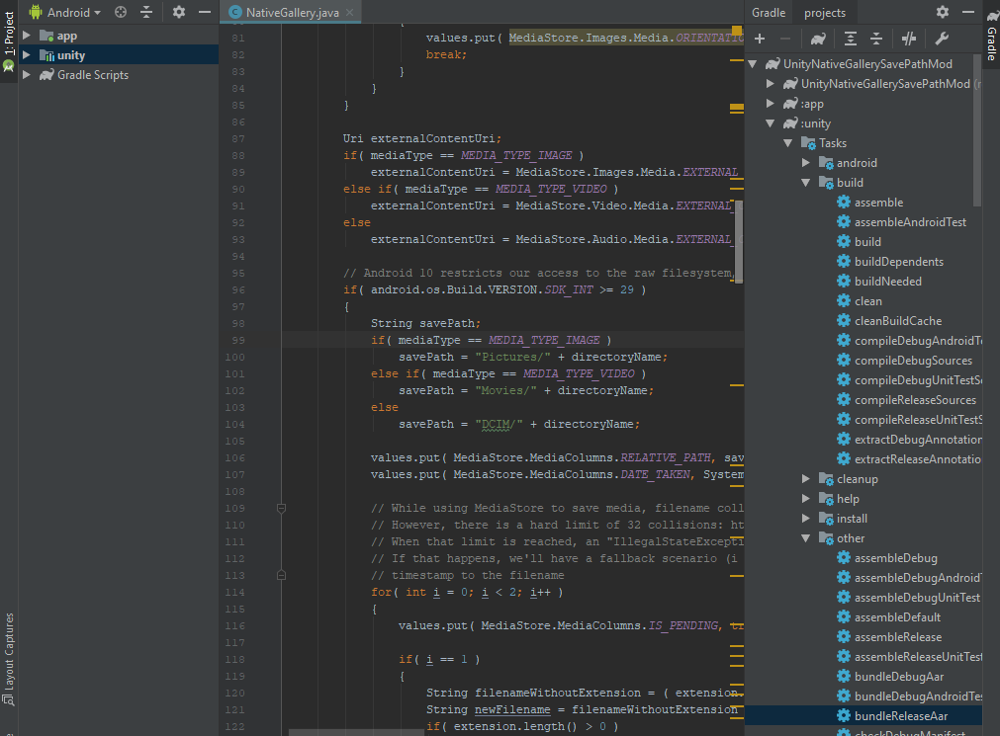

Fork of https://github.com/yasirkula/UnityNativeGallery.git with the save path changed to `Pictures/`, `Movies/`, or `DCIM/` based on the file type. Originally, it saved everything to the `DCIM/` path.

## Build process

Modifications to *NativeGallery.java* requires a rebuild.

Currently, this is the process:

- There is a separate project at **../UnityNativeGallerySavePathMod** that is used to build

- Open the project in Android Studio

- Once changes have been made to the *NativeGallery.java* file, copy and paste it into the same file in the Android Studio project. Path to the java file is here:

    `\UnityNativeGallerySavePathMod\unity\src\main\java\com\yasirkula\unity\NativeGallery.java`

- Then run the *bundleReleaseAar* task by double clicking it (see screenshot below)

- Once completed, you can find the output at:

    `\UnityNativeGallerySavePathMod\unity\build\outputs\aar\unity-release.aar`

- Replace `.\Plugins\NativeGallery\Android\NativeGallery.aar` with the one above